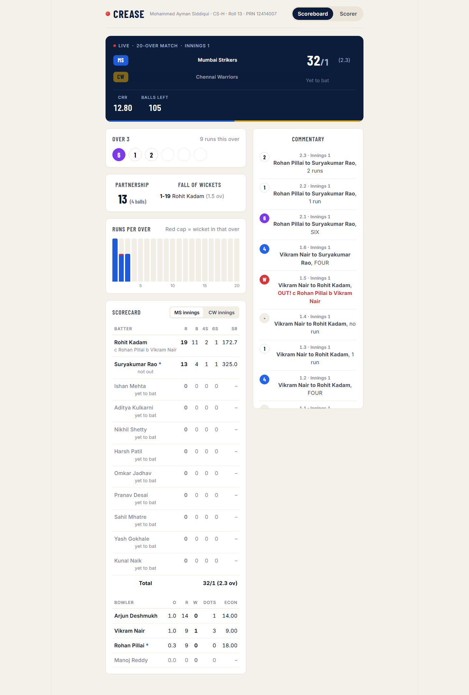
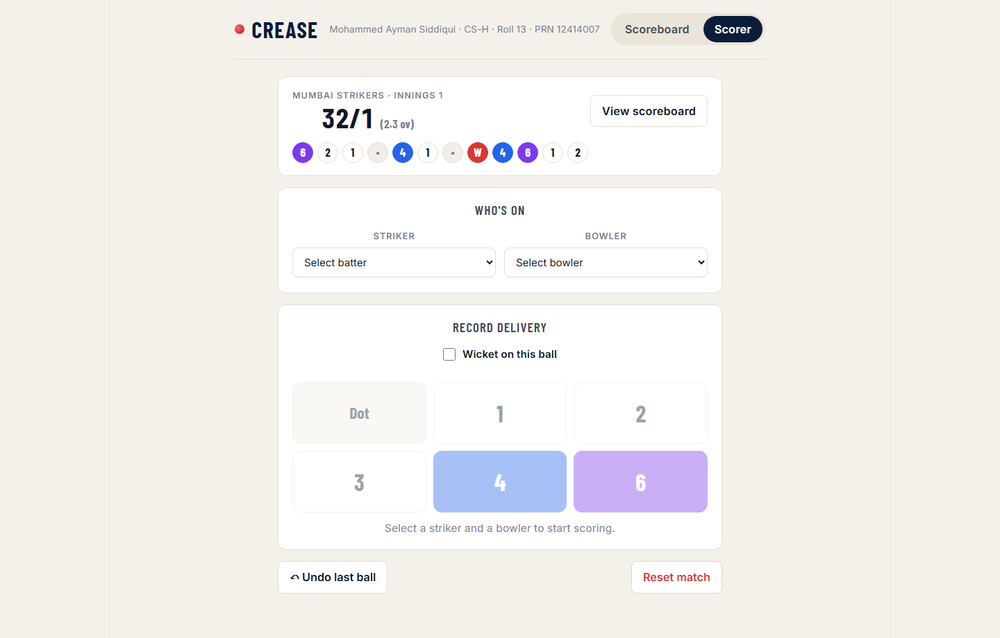

# Cricket Score Management System (Frontend)

A live-updating cricket scoreboard dashboard built with React, providing ball-by-ball scoring controls and real-time match statistics.

## Features
- Live scoreboard with auto-refresh (polling every 5 seconds)
- Ball-by-ball scoring interface (select striker/bowler, record runs or wickets)
- Dismissal type selection (Bowled/Caught/LBW/Stumped/Run Out) with fielder attribution
- Batting and bowling stat tables (strike rate, economy)
- Second-innings target/required-runs display
- Match completion screen with calculated result

## Tech Stack
- React 19 (Vite)
- Fetch API with polling for near-real-time updates

## Setup
```bash
npm install
npm run dev
```

Requires the `cricket-score-springboot` backend running on `http://localhost:8080`.

## Screenshots





